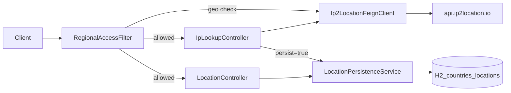

# Building an IP geolocation micro-API with Spring Boot 4, OpenFeign, and JPA

*Alternative titles: From IP lookup to persisted locations: Spring Cloud OpenFeign + IP2Location.io · IP geolocation, JPA, and optional country-level geo-gating in Spring Boot 4*

---

## TL;DR

This post walks through a small Spring Boot service that **looks up IP geolocation** via [IP2Location.io](https://www.ip2location.io/) using **Spring Cloud OpenFeign**, optionally **saves** results with **JPA** into a **normalized** `Country` + `Location` model (H2 in dev), and can **geo-gate HTTP traffic** so only clients whose IP resolves to selected countries reach the app (by default **NG, KE, GH, RW**). You get thin REST endpoints, a servlet **filter** for regional access, a reusable persistence service, and a pattern you can swap to a real database later.

A companion **[README](README.md)** in the repo lists commands, config keys, and API tables.

**Disclaimer:** This tutorial is educational. **IP2Location.io** is a third-party service—check their **terms of use**, **pricing**, and whether your usage requires an **API key** or specific query parameters. This article is **not** affiliated with IP2Location.io.

---

## Why this pattern?

Many products need **geo context** for an IP: compliance hints, UX defaults, fraud signals, or analytics. The integration details—HTTP, parsing, retries, errors—should stay **out of your controllers** as much as possible.

A declarative **Feign** client keeps the outbound call **readable**. A dedicated **persistence service** keeps “save this lookup” logic **one place**, whether the data arrives from `POST /locations` or from `GET /location?persist=true`.

---

## What we built

A minimal **sample** service that:

1. **Proxies** geolocation lookups to the remote API through a Feign interface.
2. Exposes **`GET /location`** (optional `ip`, optional `persist`).
3. Exposes **`POST /locations`** to save IP2Location-style JSON explicitly.
4. Persists a **simple `Country`** row (code + name) and a **`Location`** row (IP, region, city, coordinates, etc.) linked by foreign key.
5. **Optionally geo-gates** HTTP traffic: `RegionalAccessFilter` resolves the client IP, calls the same Feign client, and returns **403** when the country is outside `regional-access.allowed-country-codes` (see `application.yaml`).

Stack (from this project’s `pom.xml`):

- **Spring Boot 4.0.4**, **Java 17**
- **spring-boot-starter-webmvc**
- **spring-cloud-starter-openfeign** with Spring Cloud BOM **2025.1.1**
- **spring-boot-starter-data-jpa** + **H2** (in-memory)
- **spring-boot-starter-data-jpa-test** + **spring-boot-starter-webmvc-test** for the test suite

The app listens on port **7020** (see `src/main/resources/application.yaml`).

---

## Architecture at a glance

**Text version (easy to paste into Medium if you skip diagrams):**  
Browser or `curl` → **`RegionalAccessFilter`** (if enabled: resolve client IP → Feign → allow/deny) → **`IpLookupController`** or **`LocationController`** → **Feign** → **api.ip2location.io**; when persisting, **`LocationPersistenceService`** → **H2** (`countries`, `locations`).

**Mermaid** (renders on GitHub/GitLab; on Medium you may redraw as a simple image or use the text version above):



---

## Feign client: declarative HTTP

Enable Feign on the Spring Boot application:

```java
@SpringBootApplication
@EnableFeignClients
public class DemoApplication {
    public static void main(String[] args) {
        SpringApplication.run(DemoApplication.class, args);
    }
}
```

The client interface binds to configurable base URL and exposes two operations—lookup by IP and “current” lookup:

```java
@FeignClient(name = "ip2locationClient", url = "${ip2location.base-url:https://api.ip2location.io}")
public interface Ip2LocationFeignClient {

    @GetMapping
    Map<String, Object> getLocation(@RequestParam("ip") String ip);

    @GetMapping
    Map<String, Object> getCurrentLocation();
}
```

**Why `Map<String, Object>`?** It’s a pragmatic default when you’re iterating quickly: the remote JSON can vary, and you avoid a parade of DTO updates. The tradeoff is **weak typing**—production code often graduates to **typed DTOs** plus validation, or `@JsonAnySetter` patterns, once the API stabilizes.

**Operations tip:** Override `ip2location.base-url` in config if you use a staging URL or a gateway. If the provider requires **API keys** or extra query params, extend the Feign methods (or use a `RequestInterceptor`)—don’t scatter raw URLs across the app.

---

## REST API reference

| Endpoint | Behavior |
|----------|----------|
| `GET /location` | Calls Feign: **current** IP when `ip` is omitted; otherwise `?ip=…`. Returns the raw lookup `Map`. |
| `GET /location?persist=true` | Same lookup; if successful, maps the payload and saves via `LocationPersistenceService`. **200** → `{ "lookup": { … }, "saved": { … } }`. **422** → `{ "lookup": { … }, "error": "…" }` when required fields for persistence are missing. |
| `POST /locations` | Request body matches IP2Location-style JSON (`CreateLocationRequest`). **201** + `Location`-like response on success; **400** + `{ "error": "…" }` on validation failure. |

**Regional access:** When `regional-access.enabled` is **true**, most requests hit the filter first. If the client IP (after proxy headers) resolves to a **country not** in `allowed-country-codes`, the response is **403** JSON (`REGION_NOT_ALLOWED`, `COUNTRY_UNKNOWN`, etc.). **`allow-private-networks: true`** skips the check for localhost / RFC1918-style addresses (typical local dev). Paths under `permit-all-path-prefixes` (e.g. `/h2-console`) are not gated.

**Persistence rules:** Saving requires **non-blank** `ip`, `country_code`, and `country_name`. Country rows are **find-or-create** by normalized **uppercase** `country_code`.

---

## Data model: keep `Country` boring

- **`Country`**: `id`, unique `country_code`, `country_name`.
- **`Location`**: `ip`, region/city, lat/long, zip, time zone, ASN, and **`ManyToOne`** → `Country`.

This split avoids copying **country metadata** onto every lookup row. Each **lookup event** is a **location** row; **countries** deduplicate naturally.

---

## Mapping messy JSON into your schema

`CreateLocationRequest.fromIp2LocationMap` bridges the Feign `Map` into something `LocationPersistenceService` understands. It tolerates **snake_case** (`country_code`) and **camelCase** (`countryCode`) keys so small API or client changes don’t break you immediately.

Core persistence flow (simplified excerpt):

```java
@Transactional
public LocationResponse persist(CreateLocationRequest body) {
    if (body.getIp() == null || body.getIp().isBlank()) {
        throw new IllegalArgumentException("ip is required to save a location");
    }
    if (body.getCountryCode() == null || body.getCountryCode().isBlank()) {
        throw new IllegalArgumentException("country_code is required to save a location");
    }
    if (body.getCountryName() == null || body.getCountryName().isBlank()) {
        throw new IllegalArgumentException("country_name is required to save a location");
    }

    String code = body.getCountryCode().trim().toUpperCase();
    Country country = countryRepository
            .findByCountryCode(code)
            .orElseGet(() -> {
                Country c = new Country();
                c.setCountryCode(code);
                c.setCountryName(body.getCountryName().trim());
                return countryRepository.save(c);
            });

    Location location = new Location();
    location.setIp(body.getIp().trim());
    location.setCountry(country);
    location.setRegionName(body.getRegionName());
    location.setCityName(body.getCityName());
    location.setLatitude(body.getLatitude());
    location.setLongitude(body.getLongitude());
    location.setZipCode(body.getZipCode());
    location.setTimeZone(body.getTimeZone());
    location.setAsn(body.getAsn());

    Location saved = locationRepository.save(location);
    return LocationResponse.from(saved, country);
}
```

---

## Gotcha: bean names and two “location” concepts

This project deliberately splits **IP lookup** (`IpLookupController`, `GET /location`) from **persisted locations** (`LocationController`, `POST /locations`). With default `@RestController` naming, two classes named `LocationController` would collide. Renaming the Feign-facing controller avoids a **`ConflictingBeanDefinitionException`**—worth remembering when you grow the codebase.

## Tests

The module ships with **JUnit 5** coverage: pure utilities (`ClientIpResolver`, `Ip2LocationMaps`), services (`LocationPersistenceService`, `GeoEnforcementService`), the regional **filter**, `MockMvc` **standalone** controller tests, and **`@DataJpaTest`** repository slices. **`src/test/resources/application.yaml`** turns off `regional-access` so tests do not require live IP2Location from the gate. Run **`./mvnw test`** from the `demo/` directory.

---

## Run it locally

From the `demo` module directory:

```bash
./mvnw test
./mvnw spring-boot:run
```

**Lookup only:**

```bash
curl -s "http://localhost:7020/location"
curl -s "http://localhost:7020/location?ip=8.8.8.8"
```

**Lookup and persist:**

```bash
curl -s "http://localhost:7020/location?persist=true"
```

**Explicit save (example body):**

```bash
curl -s -X POST "http://localhost:7020/locations" \
  -H "Content-Type: application/json" \
  -d '{
    "ip": "41.90.137.253",
    "country_code": "KE",
    "country_name": "Kenya",
    "region_name": "Nairobi City",
    "city_name": "Nairobi",
    "latitude": -1.28333,
    "longitude": 36.81667,
    "zip_code": null,
    "time_zone": "+03:00",
    "asn": "33771"
  }'
```

**H2 note:** In-memory data is **lost on restart** unless you point JPA at a file or external database.

**Regional gate:** If you develop from a **non-allowed** country with **`allow-private-networks: false`**, temporarily add your ISO code, use localhost/private IP where the bypass applies, or set **`regional-access.enabled: false`** locally.

---

## What I’d add next

- **Strongly typed Feign DTOs** + Bean Validation on ingress.
- **Caching** (e.g., Caffeine) for IP → country in the filter to reduce duplicate outbound calls.
- **Flyway/Liquibase** instead of `ddl-auto` in real environments.
- **Idempotency** (e.g., dedupe by `ip` + time window, or client-supplied keys).
- **Production datasource**, connection pooling, and **observability** (metrics/traces on Feign calls).
- **Resilience**: timeouts, retries with backoff, and a circuit breaker where appropriate.

---

## Closing

This sample is a **small, honest** slice of a real integration: outbound HTTP via **OpenFeign**, optional **regional access control**, REST shaped for your app, and persistence that respects a **normalized** domain. Swap H2 for Postgres, tighten DTOs, tune the gate (and caches), and wire the provider’s auth model—and you’re most of the way to something you can ship.

See **[README.md](README.md)** for a concise feature list, configuration table, and API summary.

*If you reuse this pattern, verify compliance and data-retention requirements for storing IP-derived data in your jurisdiction.*
